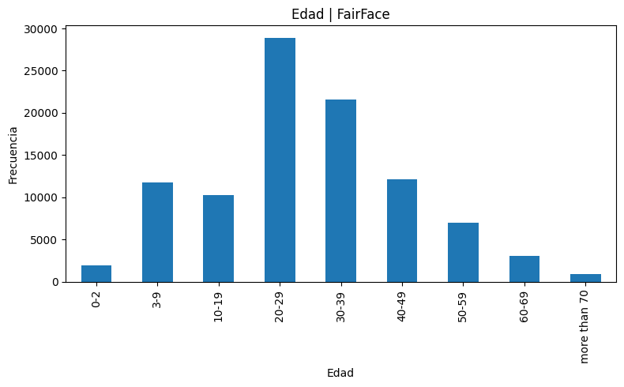
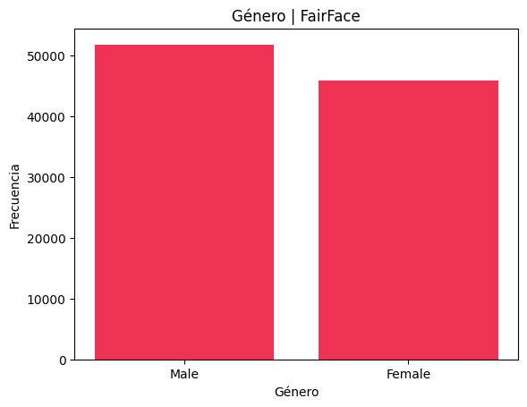
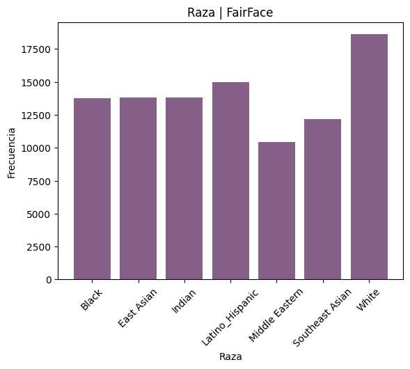
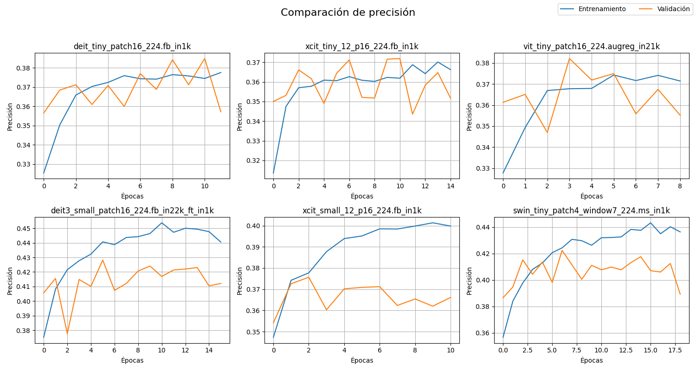
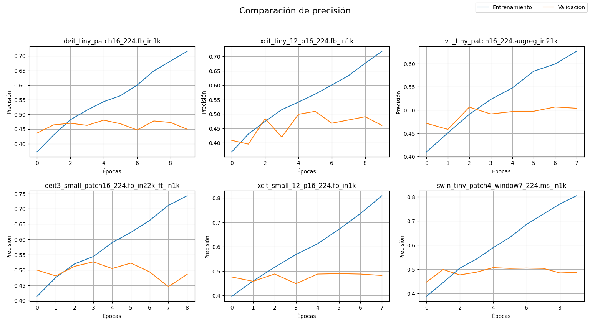
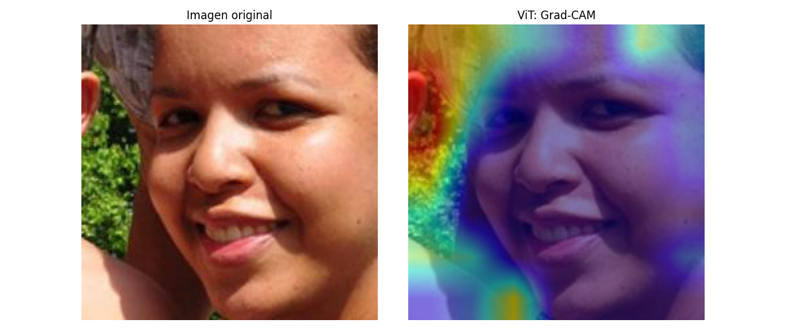
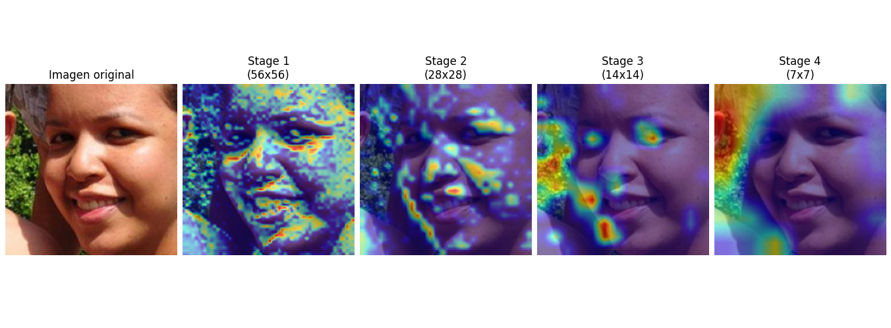
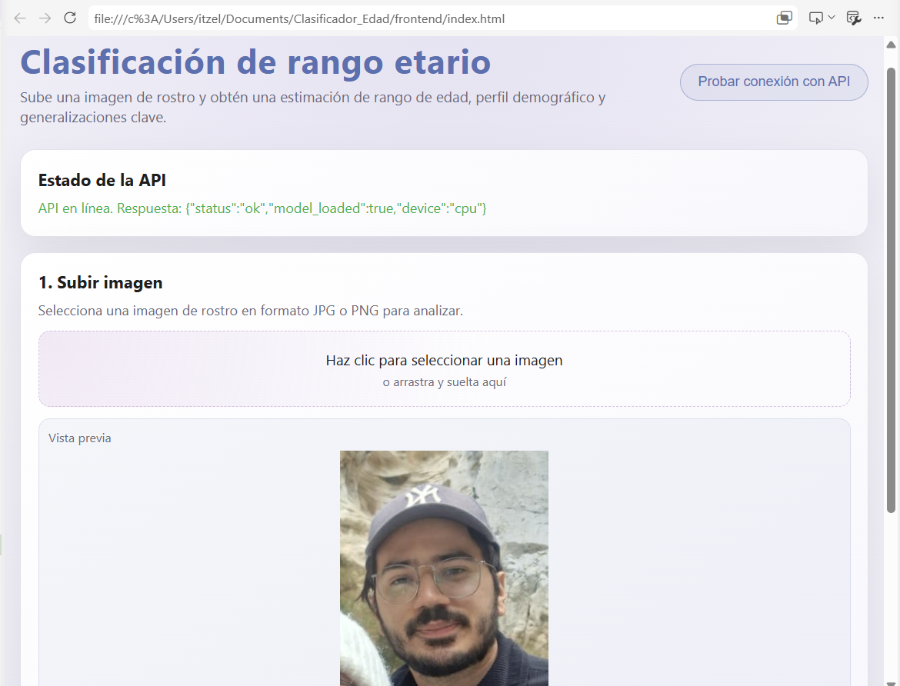

# PRESENTACION.md

# Clasificador_Edad: Desarrollo del Proyecto

Proyecto de creación de un clasificador de imágenes faciales para estimar rangos de edad utilizando modelos de aprendizaje profundo basados en Vision Transformers y redes neuronales convolucionales.

Autoras: Andrea Itzel Gregorio Martínez

---

## Objetivo

El objetivo principal de este proyecto es desarrollar un clasificador de imágenes basado en redes neuronales capaz de determinar el rango etario al que pertenece una persona a partir de la fotografía de su rostro.

Se evaluaron arquitecturas basadas en redes neuronales convolucionales y Vision Transformers, buscando identificar aquellas que ofrecieran el mejor desempeño para la tarea de clasificación y analizar posteriormente el comportamiento del modelo seleccionado mediante técnicas de explicabilidad.

---

## Objetivo específico

Se buscó que el clasificador sea capaz de determinar a cuál de las siguientes nueve categorías de edad (en años) pertenece una persona: [0,2], [3,9], [10, 19], [20,29], [30, 39], [40, 49], [50, 59], [60, 69], +70. Asimismo, se espera que el modelo seleccionado alcance al menos un 87\% de \textit{One-off Accuracy} en el conjunto de validación.

---

## Dataset utilizado

Se utilizó el dataset FairFace, un conjunto de datos de imágenes faciales etiquetadas por edad, género y raza.

Para este proyecto únicamente se empleó la etiqueta de edad como variable objetivo.

Antes de entrenar los modelos se realizó un análisis exploratorio de datos con el fin de comprender la distribución de las clases presentes en el conjunto de datos.

### Distribución de edades

Pegar aquí:

```markdown

```

### Distribución de género

Pegar aquí:

```markdown

```

### Distribución de raza

Pegar aquí:

```markdown

```

El análisis permitió verificar la distribución de las etiquetas disponibles y detectar posibles desbalances entre clases.

---

## Preparación del dataset

Inicialmente se descargó el dataset FairFace y se reorganizaron las imágenes en una estructura de carpetas adecuada para entrenamiento, validación y prueba (`dev_model/fairface_reorganizado`).

Posteriormente se construyeron los objetos Dataset y DataLoader utilizados durante el entrenamiento de los modelos.

La estructura general seguida fue:

```text
FairFace
    ↓
Reorganización de datos
    ↓
Train / Validation / Test
    ↓
Dataset y DataLoaders
    ↓
Entrenamiento de modelos
```

---

## Primeros experimentos

Debido al costo computacional asociado al entrenamiento de múltiples modelos, inicialmente se trabajó con una muestra correspondiente al 20% del dataset.

Durante esta etapa se evaluaron distintos modelos Vision Transformer disponibles en la librería timm.

Los modelos comparados fueron:

* deit3_small_patch_16_224.fb_in22k_ft_ink1
* vit_tiny_patch16_224.augreg_in21k
* xcit_small_12_p16_224.fb_in1k
* swin_tiny_patch4_window7_224.ms_ink1
* deit_tiny_patch16_224.fb_in1k
* xcit_tiny_12_p16_224.fb_in1k

Los resultados obtenidos fueron los siguientes:


*Modelos descongelados*
| Modelo                                    | Test Accuracy | One-Off Accuracy | Proporción del dataset |
| ----------------------------------------- | ------------- | ---------------- |----------------------|
| deit3_small_patch_16_224.fb_in22k_ft_ink1 | 52.2%         | 91.2%            | 20% |
| vit_tiny_patch16_224.augreg_in21k         | 52.2%         | 90.7%            | 20% |
| xcit_small_12_p16_224.fb_in1k             | 48.9%         | 89.9%            | 20% |
| swin_tiny_patch4_window7_224.ms_ink1      | 49.6%         | 89.7%            | 20% |
| deit_tiny_patch16_224.fb_in1k             | 49.0%         | 89.3%            | 20% |
| xcit_tiny_12_p16_224.fb_in1k              | 48.6%         | 89.1%            | 20% |

*Modelos congelados*
| Modelo | Test Accuracy (%) | One-Off Accuracy | Proporción del dataset |
|----------|------------------|------------------|----------------------|
| deit3_small_patch16_224.fb_in22k_ft_in1k | 43.8% | 83.4% | 20% |
| swin_tiny_patch4_window7_224.ms_in1k | 40.4% | 80.3% | 20% |
| xcit_small_12_p16_224.fb_in1k | 38.3% | 76.8% | 20% |
| vit_tiny_patch16_224.augreg_in21k | 38.0% | 77.3% | 20% |
| deit_tiny_patch16_224.fb_in1k | 35.4% | 74.5% | 20% |
| xcit_tiny_12_p16_224.fb_in1k | 34.6% | 72.0% | 20% |

```markdown


```

Estos experimentos permitieron identificar las arquitecturas con mejor desempeño inicial para continuar con pruebas más costosas utilizando una mayor cantidad de datos.

---

## Entrenamiento con el dataset completo

Una vez identificados los modelos más prometedores, se realizaron nuevos experimentos utilizando el 100% del dataset.

El objetivo fue evaluar si las tendencias observadas durante los experimentos preliminares se mantenían al disponer de una mayor cantidad de información para entrenamiento.

| Modelo | Test Accuracy (%) | One-Off Accuracy | Proporción del dataset |
|----------|------------------|------------------|----------------------|
| swin_small_patch4_window7_224.ms_in1k | 55.1% | 94.1% | 100% |
| deit3_base_patch16_224.fb_in22k_ft_in1k | 54.4% | 93.7% | 100% |
| deit3_small_patch16_224.fb_in22k_ft_in1k | 53.8% | 92.3% | 100% |
---

## Fine-Tuning

Después de comparar los distintos modelos se realizaron experimentos de fine-tuning sobre las arquitecturas seleccionadas.

Durante esta etapa se descongelaron capas previamente entrenadas con el objetivo de adaptar mejor los modelos a la tarea específica de clasificación de edad.

Para monitorear el comportamiento del entrenamiento se analizaron las curvas de pérdida y accuracy.

### Curvas de pérdida

Para revisar si en alguna se genera overfiting
*Modelos descongelados*
```markdown

```
*Modelos congelados*
```markdown

```

Estas gráficas permitieron observar la evolución del aprendizaje del modelo y detectar posibles problemas de sobreajuste o subajuste.

---

## Selección del modelo final

Tras evaluar las distintas configuraciones, el modelo con mejor desempeño fue:

```text
swin_small_patch4_window7_224.ms_in22k_ft_in1k
```

Resultados obtenidos:

* Test Accuracy: 55.1%
* One-Off Accuracy: 94.1%

La métrica One-Off Accuracy resulta especialmente relevante en esta tarea, ya que considera correctas las predicciones que difieren únicamente en una categoría adyacente de edad.

Debido a su desempeño superior, este modelo fue seleccionado para las etapas posteriores del proyecto.

---

## Explicabilidad mediante Grad-CAM

Una vez seleccionado el modelo final, se utilizó Grad-CAM para analizar qué regiones de las imágenes contribuían en mayor medida a las predicciones realizadas.

El archivo `grad_cam.py` genera mapas de activación sobre distintas etapas de la arquitectura Swin Transformer.

```markdown


```

Estas visualizaciones permiten interpretar parcialmente el comportamiento del modelo y verificar que la atención se concentra principalmente en regiones faciales relevantes para la estimación de edad.

---

## Desarrollo de API y Frontend

Como etapa final se desarrolló una API y una interfaz web para permitir realizar inferencias sobre nuevas imágenes.

La aplicación permite cargar una fotografía facial y obtener como salida el rango de edad predicho por el modelo.

### Captura de pantalla

```markdown

```

### Video de demostración

[Ver demostración](docs/Prueba del modelo.mp4)

Se incluye un video de demostración como evidencia del funcionamiento del sistema. La grabación no cuenta con edición ni formato de presentación, pero permite verificar la integración entre el modelo de clasificación y la API de Gemini.
---

## Conclusiones

Durante el desarrollo del proyecto se evaluaron múltiples arquitecturas basadas en Vision Transformers y redes neuronales convolucionales para la clasificación de edad a partir de imágenes faciales.

Los experimentos realizados mostraron que las arquitecturas basadas en Transformers alcanzaron resultados competitivos para esta tarea, siendo el modelo Swin Transformer el que obtuvo el mejor desempeño global.

Finalmente, se complementó el modelo con herramientas de explicabilidad y una interfaz de usuario que permite utilizar el clasificador de manera interactiva.
